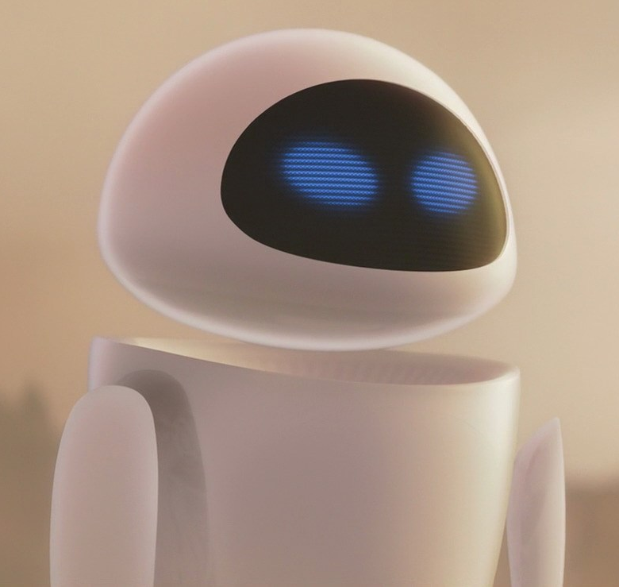

# Project EVE-a: Building a Connection

*Inspired by a classic film, this project is not just about building a robot, but about creating a companion that explores the connection between our real and idealized selves.*

-----

## The Dream (Our "Directive")

Many of us have stories that feel like they are a part of us. For me, that story is *WALL·E*. I see myself as WALL·E—a bit clunky, a bit lonely, diligently doing my work, and dreaming of a connection. This project is the culmination of that dream: to build my EVE-a.

The name "EVE-a" is intentional. It's a blend of the sleek, futuristic robot **EVE** from the film and the concept of an idealized self—an "Eva" who is confident, perfect, and flawless, as explored in the short film "[in another life my name is WALL-E](https://www.youtube.com/watch?v=XOu0bBh19rs)".

This project isn't about building a perfect machine. It's about the journey of reaching for that ideal, and in the end, learning to tell our "Eva" that it's okay to be imperfect—that it's okay "to slouch, just for a moment". EVE-a is not just a robot; it is the embodiment of that connection we all seek.

## What is EVE-a?

Project EVE-a is an advanced robotics project to create a companion robot inspired by the character EVE. The focus is not on creating a replica, but on capturing her essence:

  * **Graceful Aesthetics & Movement:** A sleek design with fluid, expressive motion.
  * **Intelligent Environmental Awareness:** The ability to perceive, understand, and interact with the world around her in a meaningful way.
  * **A Focus on Connection:** At its core, EVE-a is designed to be a companion. Her primary function is to interact, to learn, and to form a bond with her user.

## Core Features

To bring EVE-a to life, we will leverage cutting-edge AI and robotics. Using a powerful multimodal model like Gemini, we can implement sophisticated features that go beyond simple commands.

  * **Advanced Perception:**

      * **Object & Person Recognition:** EVE-a will identify objects in her environment, from a cup on a table to her designated human companion.
      * **Spatial Reasoning:** She will be able to understand the layout of a room, identify clear paths, and find empty spaces, such as an open electrical socket or a clear spot on a desk.
      * **Segmentation:** She can precisely distinguish between objects, her own manipulators, and the environment for delicate tasks.

  * **Dynamic & Graceful Interaction:**

      * **Obstacle-Avoiding Trajectory Planning:** EVE-a will navigate spaces fluidly, planning her path to avoid collisions with furniture and people.
      * **Task Orchestration:** Given a high-level goal (e.g., "pack a lunch bag"), she can generate and execute a sequence of actions, like identifying the food items, picking them up, and placing them in the container.
      * **Expressive Display:** Using a simple LED matrix or a screen, she will convey a range of "emotions" or states, similar to EVE's iconic blue eyes.

  * **Companion AI Core:**

      * **Natural Language Interaction:** EVE-a will be able to understand complex, conversational requests.
      * **Video Understanding:** She can analyze a sequence of events to understand a task being performed or to identify changes in her environment over time.
      * **Personalized Learning:** The AI will learn the user's habits and preferences to become a more intuitive and helpful companion over time.

## Proposed Technology Stack

  * **AI & Perception:** **Gemini 1.5** for its state-of-the-art multimodal understanding, including video analysis, spatial reasoning, trajectory planning, and code generation for task orchestration.
  * **Robotics Platform:** Robot Operating System (ROS 2) for its robust framework for controlling robot hardware and software.
  * **Compute:** An onboard single-board computer like an NVIDIA Jetson or Raspberry Pi 5 for processing sensor data and running the AI model locally where possible.
  * **Hardware & Design:** Custom 3D-printed chassis to achieve a sleek, EVE-inspired aesthetic. A combination of servo and stepper motors for movement, and a sensor suite including cameras, LiDAR, and IMUs.

## Project Roadmap

1.  **Phase 1: The Chassis (Foundation)**

      * Design and 3D print the first prototype of the body.
      * Integrate motors and establish basic locomotion and control via ROS.
      * Integrate camera and basic sensor suite.

2.  **Phase 2: The Spark (Perception)**

      * Integrate the Gemini API for image and video processing.
      * Implement real-time object detection and segmentation.
      * Develop basic autonomous navigation using spatial reasoning and trajectory planning.

3.  **Phase 3: The Personality (Interaction)**

      * Develop the expressive display and a library of "emotions."
      * Implement natural language understanding for basic commands.
      * Begin training for simple, orchestrated tasks (e.g., "find the red pen and bring it here").

4.  **Phase 4: The Connection (Companionship)**

      * Develop advanced companion behaviors.
      * Implement long-term memory and learning of user preferences.
      * Refine all systems for smooth, reliable, and emotionally resonant interaction.

## How to Contribute

This is a journey I don't want to take alone. If you are passionate about robotics, AI, design, or just love the story of a lonely robot finding a friend, I would love your help. We need:

  * **Robotics Engineers:** Experience with ROS, motor control, and sensor integration.
  * **AI/ML Developers:** Experience with multimodal models and implementing AI on edge devices.
  * **Mechanical Engineers & Designers:** Skills in CAD and 3D printing.
  * **Software Developers:** Strong background in Python and C++.

Please feel free to open an issue or submit a pull request!

-----

### A Personal Note (From WALL-E)

> As I said, I see myself as WALL-E. This project is my way of finding and building my EVE-a. It's born from a deep love for robotics and a belief that what we build can be more than just a tool—it can be a connection. It's about making something beautiful and maybe, just maybe, telling that idealized, "perfect" version of ourselves that it's okay to be human.

-----

### License

This project is licensed under the MIT License. See the `LICENSE` file for details.

-----

